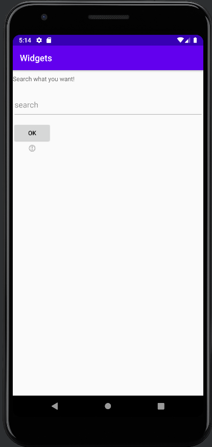

# Rapport

**Skriv din rapport här!**


## Följande grundsyn gäller dugga-svar:

- Jag använder LinearLayout för min layout utseende.
- Jag har skapat 'EditText', 'ImageView', and 'Button' i den LinearLayout och med margin på.
- Jag har skapat ett textView med den andra layout ConstraintLayout.
```
<LinearLayout xmlns:android="http://schemas.android.com/apk/res/android"
    xmlns:app="http://schemas.android.com/apk/res-auto"
    xmlns:tools="http://schemas.android.com/tools"
    android:layout_width="match_parent"
    android:layout_height="match_parent"
    tools:context=".MainActivity"
    android:orientation="vertical"> //skapa linearlayout//
    
<EditText
    android:id="@+id/myNewEdt"
    android:layout_width="match_parent"
    android:layout_height="59dp"
    android:layout_marginTop="20dp"
    android:hint="search" /> //skapa edittext//
        
<Button
    android:id="@+id/myNewBtn"
    android:text="Ok"
    android:layout_width="wrap_content"
    android:layout_height="wrap_content"
    android:layout_marginTop="10dp"/> //skapa button//
        
<ImageView
    android:id="@+id/imageView2"
    android:layout_width="88dp"
    android:layout_height="21dp"
    android:layout_marginBottom="10dp"
    app:srcCompat="@android:drawable/ic_menu_info_details" /> //skapa imageview//
    
 <TextView
    android:layout_width="wrap_content"
    ndroid:layout_height="wrap_content"
    android:layout_marginTop="10dp"
    android:text="Search what you want!"
    android:id="@+id/hilding"
    app:layout_constraintBottom_toBottomOf="parent"
    app:layout_constraintLeft_toLeftOf="parent"
    app:layout_constraintRight_toRightOf="parent"
    app:layout_constraintTop_toTopOf="parent" /> //Skapa textview med constrainLayout//
```




